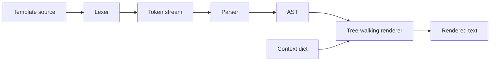

# Mini Template Engine

[](https://github.com/PrincetonAfeez/Mini-Template-Engine/actions/workflows/ci.yml)


A pure-Python, Jinja-inspired template engine built to demonstrate lexing, parsing,
AST design, and tree-walking evaluation — with secure HTML defaults and zero runtime
dependencies.

> **Showcase output** — `python -m template_engine examples/showcase.tmpl --context examples/context.json`

## Project highlights

- **Compiler-style pipeline** — lexer → parser → AST → recursive renderer
- **Documented architecture** — [5 ADRs](docs/adr/) with grammar and lifecycle docs
- **Security defaults** — HTML autoescaping, no `eval`, no callable/method access
- **Developer tooling** — CLI debug modes, Ruff, Mypy, 95%+ coverage gate in CI
- **Portfolio ready** — examples, benchmarks, reflection write-up, MIT license

## Learning goals

This project demonstrates:

1. Tokenization with line/column tracking and whitespace trim markers
2. Recursive-descent parsing with block nesting and stop tags
3. AST modeling with immutable dataclasses
4. Contextual evaluation with lexical scoping (`for`, `set`, filters)
5. Secure-by-default output encoding for HTML templates

See [docs/reflection.md](docs/reflection.md) for trade-offs and v2 ideas.

## Architecture



Detailed sequence: [docs/render-lifecycle.md](docs/render-lifecycle.md)  
Formal grammar: [docs/grammar.md](docs/grammar.md)  
API reference: [docs/api.md](docs/api.md)

## Quick start

```bash
pip install mini-template-engine
# or from source:
pip install -e ".[dev]"
python -m template_engine examples/hello.tmpl --context examples/context.json
pytest
# or: coverage run -m pytest -q && coverage report --fail-under=95
```

Windows demo script: `.\scripts\demo.ps1`  
Full quality gate: `.\scripts\test.ps1`

## Library usage

```python
from template_engine import Template

template = Template("Hello, {{ user.name | title }}!")
output = template.render({"user": {"name": "princeton"}})
print(output)  # Hello, Princeton!
```

Autoescaping is enabled by default. Use `| safe` only for trusted HTML.

Custom filters:

```python
from template_engine import FilterRegistry, Template, default_filter_registry

registry = default_filter_registry()
registry.register("shout", lambda value: str(value).upper() + "!")
Template("{{ name | shout }}", filters=registry).render({"name": "hi"})
```

## CLI usage

```bash
template-engine --help
template-engine examples/conditions.tmpl --check
template-engine examples/loop.tmpl --dump-ast
template-engine examples/hello.tmpl --set user.name=Princeton -v
template-engine examples/showcase.tmpl --context examples/context.json
template-engine --version
```

Load extra filters: `--filter-module my_module` (module must expose `filter_registry`).

Debug workflow for graders:

```bash
python -m template_engine examples/invoice.tmpl --dump-tokens
python -m template_engine examples/invoice.tmpl --dump-ast
```

## Supported syntax

Variables, literals, filters, ``, conditionals, loops, raw blocks, comments,
and whitespace trimming — see [docs/api.md](docs/api.md).

## Not Jinja

- No arbitrary Python, method calls, property getters, or `eval`
- No includes/macros ([ADR 0005](docs/adr/0005-single-file-templates-only.md))
- `for` rejects strings; dict loops iterate keys
- Literal `{{` / `{%` require ``
- Conditions: `==`, `!=`, truthiness, `not` only (no `and`/`or`)
- `default` treats `""` as missing; use `default_if_none` otherwise

## ADR index

| ADR | Decision |
|-----|----------|
| [0001](docs/adr/0001-tree-walking-interpreter.md) | Tree-walking renderer over bytecode |
| [0002](docs/adr/0002-autoescaping-on-by-default.md) | HTML autoescaping on by default |
| [0003](docs/adr/0003-no-arbitrary-python-expressions.md) | Small expression grammar only |
| [0004](docs/adr/0004-library-core-over-framework-first.md) | Library core before CLI/framework |
| [0005](docs/adr/0005-single-file-templates-only.md) | Single-file templates only |

## Benchmarks

Run locally (includes stage timings and a `cProfile` summary):

```bash
python benchmarks/render_bench.py
```

Results are saved to `benchmarks/results.json`. Sample run on Windows / Python 3.14:

| Template | Iterations | ms/render | lex | parse | render |
|----------|------------|-----------|-----|-------|--------|
| small (`Hello {{ name \| title }}!`) | 10,000 | **0.007** | 0.011 ms | 0.015 ms | 0.008 ms |
| medium (`examples/invoice.tmpl`) | 5,000 | **0.021** | 0.024 ms | 0.049 ms | 0.016 ms |
| large (invoice + 20× loop) | 500 | **9.5** | 0.55 ms | 0.59 ms | 9.7 ms |

Complexity: lex **O(n)**, parse **O(n)**, render **O(nodes)**. Profiling shows render dominates on large templates because loop bodies materialize iterables.

## Install from PyPI

```bash
pip install mini-template-engine
```

See [docs/PYPI.md](docs/PYPI.md) for maintainer release steps.

## Contributing

See [CONTRIBUTING.md](CONTRIBUTING.md). Security policy: [SECURITY.md](SECURITY.md).

## Changelog

See [CHANGELOG.md](CHANGELOG.md).

## License

MIT — see [LICENSE](LICENSE).
