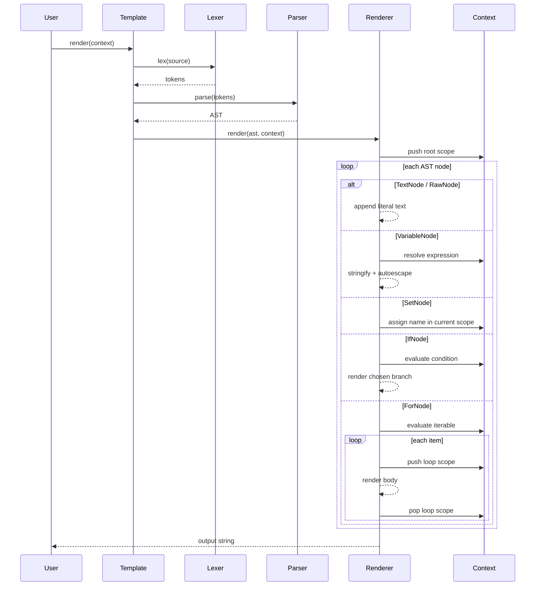

# Render Lifecycle

How a template moves from source text to output.

## Scope rules

| Event | Scope behavior |
|-------|----------------|
| `render()` starts | Root context dict becomes bottom scope |
| `` iteration | Push `{ item, loop }`; pop after body |
| `` | Assigns into innermost scope (can shadow outers) |
| Variable lookup | Search scopes inner → outer |

## Filter evaluation

1. Evaluate expression base (lenient when `strict` + `default` filter).
2. Evaluate filter arguments left to right.
3. Apply each filter in chain order.
4. Apply autoescaping when stringifying variable output (unless `SafeString`).

## Complexity

| Stage | Time | Space |
|-------|------|-------|
| Lex | O(n) | O(n) tokens |
| Parse | O(n) | O(n) AST nodes |
| Render | O(nodes × context depth) | O(scope depth + loop items materialized) |

See [ADR 0001](adr/0001-tree-walking-interpreter.md) for the performance trade-off.
